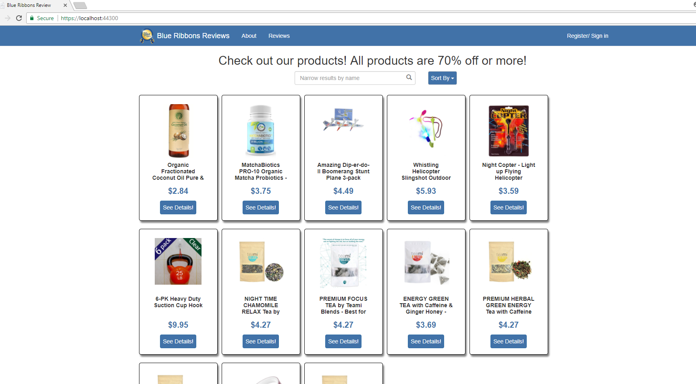
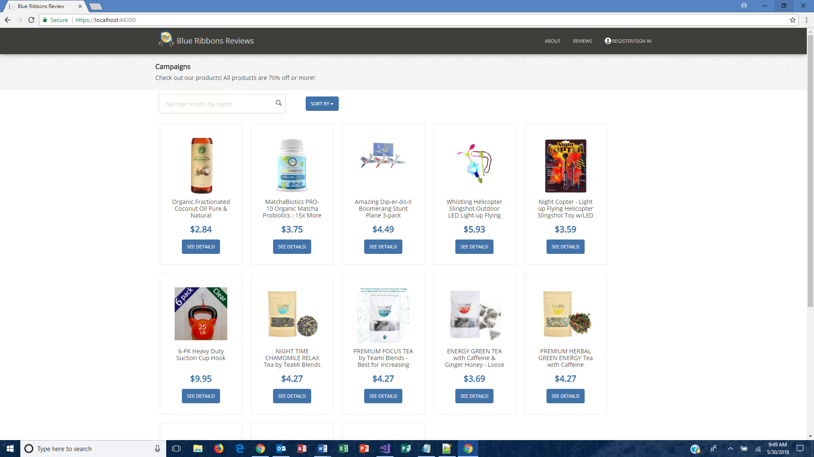
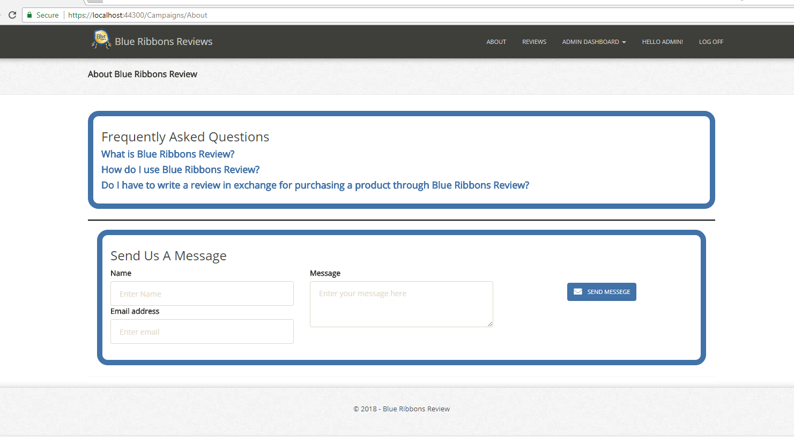
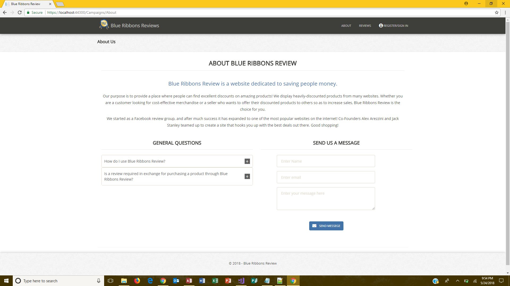
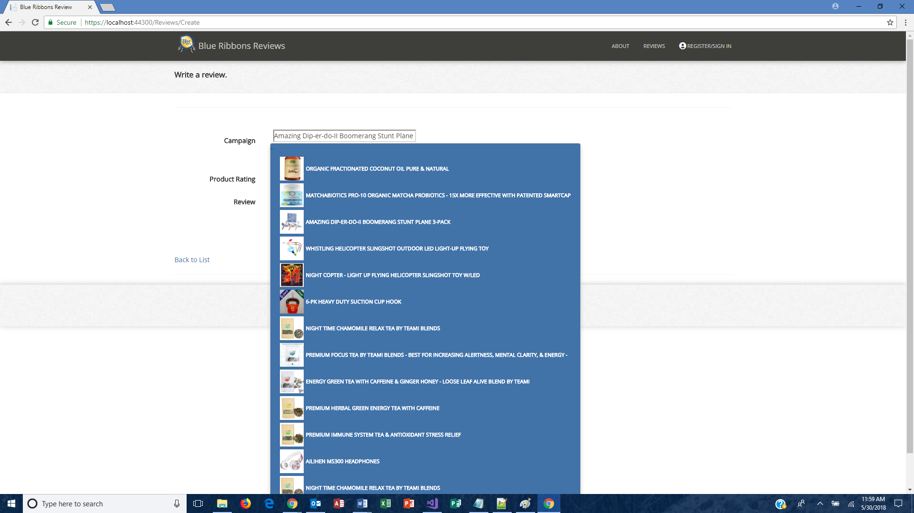
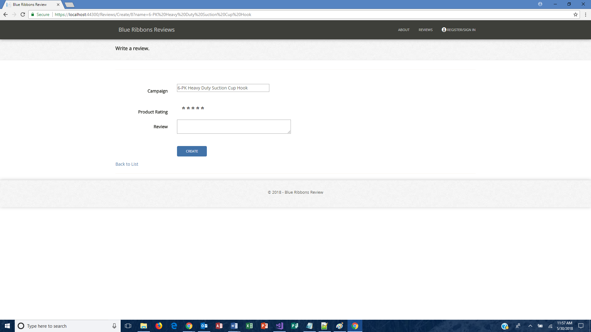

# BlueRibbon

<i>A .NET MVC project, work done as part of my Live Project at The Tech Academy</i>

This folder highlights work done for Blue Ribbons Review, a site which allows Amazon sellers to offer selected merchandise at a discount in exchange for a product review. Since the site is proprietary, the full set of code could not be included here. Instead, some of the code I adjusted is included along with descriptions and images shown below.

My work focused on (1) providing a cohesive, professional-looking user interface (UI) while maintain the brand already present and (2) improving the user experience (UX) by adjusting features to minimize user input and support intuitive interaction with the software.

<h3>Samples of my work (UI):</h3>

<strong>Note: My changes can be seen in these files: Site.css, _Layout.cshtml, _Panel.cshtml, About.cshtml, and Index.cshtml.</strong>

<ol>  
  <li>Adjusted the overall look and styling of the site to provide a more cohesive, professional look.</li> 
  <li>Added an area to hold a page-title and subtitle across the site.</li>
    <h4>Before </h4> 
    <h4>After - New Styling and Addition of Page Title Area</h4> 
     
  <li>Adjust the About page to make the content sit better on the page and look more professional.</li> 
    <h4>Before</h4> 
    <h4>After - Improved Layout and Arrangement of Page Content</h4> 
     
  <li>Displayed edit and delete icons instead of "Edit" and "Delete" links across the site.</li>
  <li>Collapsed the navbar at 991px breakpoint.</li>
</ol>

<h3>Samples of my work (UX):</h3>

<strong>Note: My changes can be seen in these files: ReviewsController.cs, Create.cshtml, and _Details.cshtml</strong>

<ol>
  <li>Dropdown on Reviews Create page - display the name of the selected item rather than its ID, but send the ID to the controller to be saved to the database.</li>
  <li>Dropdown on Reviews Create page - if the user arrived at this page from a page which already includes the product name, display a readonly textbox containing the product name instead of the dropdown box. Retain the dropdown functionality in other cases.</li>
    <h4>Page with Dropdown</h4> 
    <h4>Page with Textbox</h4> 
     
  <li>Added sort functionality to the Reviews Index page.</li>
</ol>
